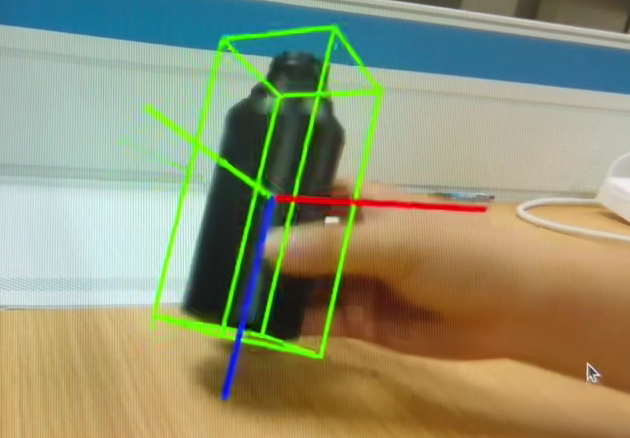
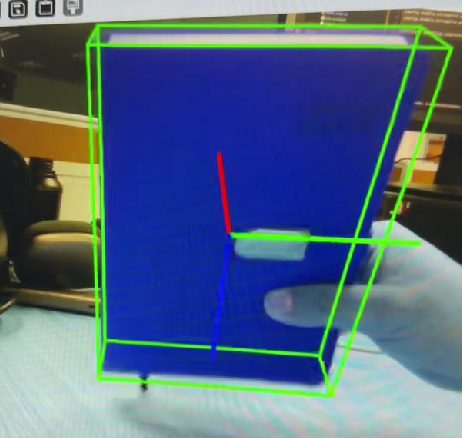
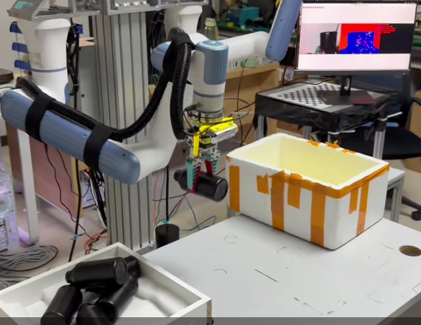

# FoundationPose Dobot Grasp

Real-time 6D object pose estimation and robotic grasping with an Intel
RealSense camera, YOLO segmentation, FoundationPose, and a Dobot 6-axis robot.

The system detects the most accessible foreground object, estimates its full
3D pose, transforms the grasp target into the robot base frame, and executes a
pick-and-place sequence with a motorized gripper.

## Demo Videos

Click a preview to open the MP4 video on GitHub.

### 6D Pose Estimation: Single Bottle

[](docs/videos/one_bottle.mp4)

[Open the single-bottle pose estimation video](docs/videos/one_bottle.mp4)

### 6D Pose Estimation: Book

[](docs/videos/book.mp4)

[Open the book pose estimation video](docs/videos/book.mp4)

### Multi-Bottle 3D Grasping

[](docs/videos/grab.mp4)

[Open the multi-bottle grasping video](docs/videos/grab.mp4)

## Features

- RealSense RGB-D acquisition and aligned depth processing
- YOLO instance segmentation with project-specific weights
- FoundationPose 6D registration and tracking
- Foreground-first target selection for stacked or overlapping bottles
- Fixed, planar, and full 3D grasp-orientation modes
- Eye-in-hand camera transformation using hand-eye calibration
- UDP bridge between the FoundationPose environment and ROS 2
- Dobot `MovL`/`MovJ` motion control and motorized gripper sequencing
- Optional SDFR pose refinement

## System Architecture

```text
RealSense RGB-D
    |
    v
YOLO segmentation and foreground target selection
    |
    v
FoundationPose 6D pose estimation
    |
    +----> optional SDFR refinement
    |
    v
Eye-in-hand / hand-eye coordinate transformation
    |
    v
UDP bridge -> ROS 2 PoseStamped
    |
    v
Dobot motion controller -> gripper -> pick and place
```

## Repository Layout

```text
foundationpose-dobot-grasp/
├── FoundationPose/
│   ├── run_realsense_yolo_foundationpose.py
│   └── yolo_foundationpose/
│       ├── assets/
│       │   ├── mesh/bottle_cad2.obj
│       │   └── weights/best_1.pt
│       └── ...                     # Online perception pipeline
├── SDFR/                           # Optional pose refinement
├── dobot/
│   └── src/
│       ├── dobot_pick_place/       # Pick/place state machine and UDP bridge
│       ├── DOBOT_6Axis_ROS2_V4/    # Dobot ROS 2 driver
│       └── Step_Motor_ROS2/        # Gripper motor driver
└── docs/
    └── videos/                     # Demonstration videos and previews
```

The bottle mesh and YOLO checkpoint used by the online pipeline are included
in this repository. The larger upstream FoundationPose scorer/refiner
checkpoints are not committed because of their size and must be installed
under `FoundationPose/weights/`.

## Requirements

- Ubuntu with ROS 2
- NVIDIA GPU with a compatible CUDA environment
- Intel RealSense RGB-D camera
- Dobot 6-axis robot and controller
- WHEELTEC step-motor gripper
- Python environment containing the packages in
  `FoundationPose/requirements.txt`

Before controlling a real robot:

- Put the Dobot controller in remote TCP mode.
- Enable the robot and clear all controller errors.
- Connect the computer and controller to the same Ethernet subnet.
- Verify that the controller IP is reachable.
- Keep the emergency stop accessible and test at a low speed.

## Build the ROS 2 Workspace

```bash
cd dobot
source /opt/ros/<ros-distro>/setup.bash
colcon build
source install/setup.bash
```

Configure the robot address and model before starting the driver:

```bash
export IP_address=<robot-controller-ip>
export DOBOT_TYPE=nova5
ping "$IP_address"
```

Replace `nova5` with the model used by your installation.

## Run the System

Start the components in three terminals from the repository root.

### Terminal 1: Dobot Driver

```bash
cd dobot
source /opt/ros/<ros-distro>/setup.bash
source install/setup.bash
ros2 launch cr_robot_ros2 dobot_bringup_ros2.launch.py
```

Wait until `RobotStatus.is_connected` is true before sending a grasp target:

```bash
ros2 topic echo /dobot_msgs_v4/msg/RobotStatus --once
```

### Terminal 2: Pick-and-Place Controller

```bash
cd dobot
source /opt/ros/<ros-distro>/setup.bash
source install/setup.bash
ros2 launch dobot_pick_place target_pose_gripper.launch.py
```

### Terminal 3: Vision and 3D Grasp Target

Activate the FoundationPose Python environment, then run:

```bash
cd FoundationPose
python run_realsense_yolo_foundationpose.py \
  --dobot_publish_target \
  --dobot_eye_in_hand 1 \
  --dobot_grasp_orientation_mode 3d
```

The default eye-in-hand calibration values are installation-specific. Replace
them with calibration results from the actual camera and gripper assembly
before operating another robot.

## Grasp Orientation Modes

| Mode | Behavior | Typical use |
| --- | --- | --- |
| `fixed` | Uses a calibrated fixed TCP orientation | Upright, similarly aligned objects |
| `planar` | Rotates the gripper around the approach axis | Objects rotated on a flat surface |
| `3d` | Aligns the gripper with the object's full 3D axis | Tilted or stacked objects |

Example:

```bash
python run_realsense_yolo_foundationpose.py \
  --dobot_publish_target \
  --dobot_eye_in_hand 1 \
  --dobot_grasp_orientation_mode planar
```

## Runtime Checks

```bash
ros2 topic echo /dobot_msgs_v4/msg/RobotStatus --once
ros2 topic echo /dobot_pick/sequence_state --once
ros2 topic echo /dobot_pick/current_pose --once
ros2 topic echo /dobot_pick/target_pose --once
```

If every Dobot service returns `res=-1`, inspect the driver terminal first. A
message such as `tcp is disconnected` indicates a controller/network problem,
not a FoundationPose or grasp-orientation failure.

## Documentation

- [Project structure](docs/PROJECT_STRUCTURE.md)
- [Cleanup notes](docs/CLEANUP_NOTES.md)
- [GitHub upload notes](docs/GITHUB_UPLOAD.md)
- [Vision pipeline](FoundationPose/yolo_foundationpose/README.md)
- [Dobot pick-and-place controller](dobot/src/dobot_pick_place/README.md)

## Acknowledgements

This project builds on:

- [FoundationPose](https://github.com/NVlabs/FoundationPose)
- [Ultralytics YOLO](https://github.com/ultralytics/ultralytics)
- [Dobot ROS 2 V4](https://github.com/Dobot-Arm/DOBOT_6Axis_ROS2_V4)
- Intel RealSense SDK
